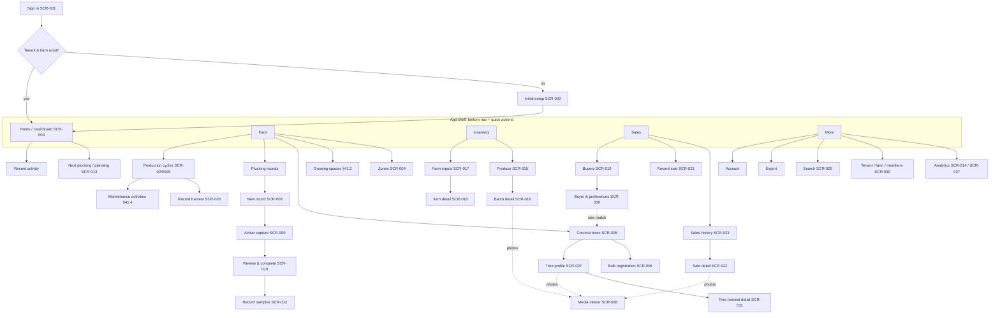

# Information Architecture: V1

Source: SRS v1.1 §20 (recommended mobile navigation), §21 (key screens), §41.15 (four pillars).

## Primary navigation (mobile bottom bar; side rail on ≥ md)

| Tab           | Answers                                       | Pillar                             |
| ------------- | --------------------------------------------- | ---------------------------------- |
| **Home**      | "What is happening on this farm now?"         | All                                |
| **Farm**      | "What do I grow, and where?"                  | Farm & Space · Crops & Maintenance |
| **Inventory** | "What do I have?"                             | Harvest & Inventory                |
| **Sales**     | "Who buys what, and what did I earn?"         | Buyers & Sales                     |
| **More**      | Analytics, settings, members, export, account | —                                  |

There is also a **persistent quick-action button** (FAB, §20) on Home, Farm, Inventory and Sales:
New Plucking Round · Record Harvest · Record Sale · Add Inventory Movement.

## Diagram

