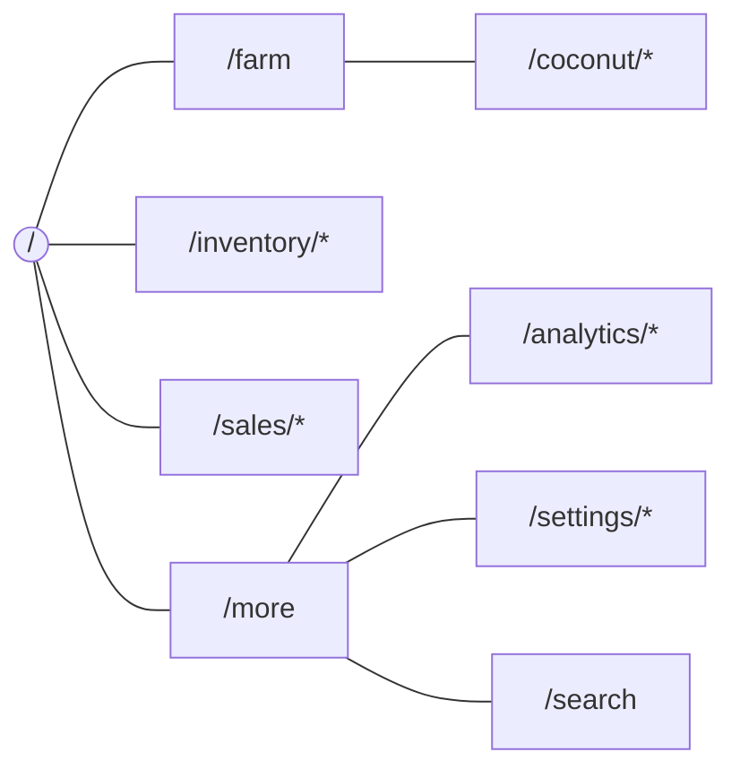

# Sitemap: V1 routes (Next.js Pages Router)

Everything except `/auth/*` requires sign-in and an active tenant context. This is an authenticated app, so nothing is listed in a public XML sitemap.

| Route                                                      | Screen                                         | Tab       | Epic     | Auth   |
| ---------------------------------------------------------- | ---------------------------------------------- | --------- | -------- | ------ |
| `/auth/login`                                              | SCR-001 Sign in                                | —         | #9       | public |
| `/auth/register`, `/auth/confirm`, `/auth/forgot-password` | Account creation & recovery                    | —         | #9       | public |
| `/setup`                                                   | SCR-002 Tenant/farm initial setup              | —         | #9       | user   |
| `/`                                                        | SCR-003 Farm dashboard                         | Home      | #17      | member |
| `/farm`                                                    | Farm overview: zones, spaces, coconut, cycles  | Farm      | #9       | member |
| `/farm/zones/[zoneId]`                                     | SCR-004 Zone detail (incl. SCR-024 Polytunnel) | Farm      | #9 / #16 | member |
| `/farm/spaces` · `/farm/spaces/[spaceId]`                  | Growing spaces                                 | Farm      | #9       | member |
| `/farm/cycles/[cycleId]`                                   | SCR-025 Production cycle                       | Farm      | #16      | member |
| `/farm/cycles/[cycleId]/harvest`                           | SCR-026 Record harvest                         | Farm      | #16      | member |
| `/coconut/trees`                                           | SCR-005 Tree list                              | Farm      | #10      | member |
| `/coconut/trees/bulk`                                      | SCR-006 Bulk registration                      | Farm      | #10      | owner  |
| `/coconut/trees/[treeId]`                                  | SCR-007 Tree profile                           | Farm      | #10      | member |
| `/coconut/rounds`                                          | Plucking round list                            | Farm      | #11      | member |
| `/coconut/rounds/new`                                      | SCR-008 New round                              | Farm      | #11      | member |
| `/coconut/rounds/[roundId]/capture`                        | SCR-009 Active capture (no bottom nav)         | —         | #11      | member |
| `/coconut/rounds/[roundId]`                                | SCR-010 Review & complete                      | Farm      | #11      | member |
| `/coconut/rounds/[roundId]/samples`                        | SCR-012 Record samples                         | Farm      | #12      | member |
| `/coconut/harvests/[harvestId]`                            | SCR-011 Tree harvest detail                    | Farm      | #11      | member |
| `/coconut/planning`                                        | SCR-013 Due-soon & planning                    | Home/Farm | #13      | member |
| `/inventory`                                               | SCR-015 Produce inventory                      | Inventory | #14      | member |
| `/inventory/batches/[batchId]`                             | SCR-016 Batch detail                           | Inventory | #14      | member |
| `/inventory/inputs` · `/inventory/inputs/[itemId]`         | SCR-017/018 Farm inputs                        | Inventory | #14      | member |
| `/sales`                                                   | SCR-023 Sales history                          | Sales     | #15      | member |
| `/sales/new`                                               | SCR-021 Record sale                            | Sales     | #15      | member |
| `/sales/[saleId]`                                          | SCR-022 Sale detail                            | Sales     | #15      | member |
| `/sales/buyers` · `/sales/buyers/[buyerId]`                | SCR-019/020 Buyers                             | Sales     | #15      | member |
| `/more`                                                    | More menu                                      | More      | #9       | viewer |
| `/analytics` · `/analytics/coconut`                        | SCR-027 / SCR-014 Analytics                    | More      | #17      | viewer |
| `/search`                                                  | SCR-029 Search                                 | More      | #17      | viewer |
| `/settings` · `/settings/members`                          | SCR-030 Tenant, farm & members                 | More      | #9       | owner  |
| (modal)                                                    | SCR-028 Media viewer                           | —         | #10      | member |

"member" means OWNER or MEMBER. VIEWER can read every member page, but mutations and quick actions are hidden (§4.3).

